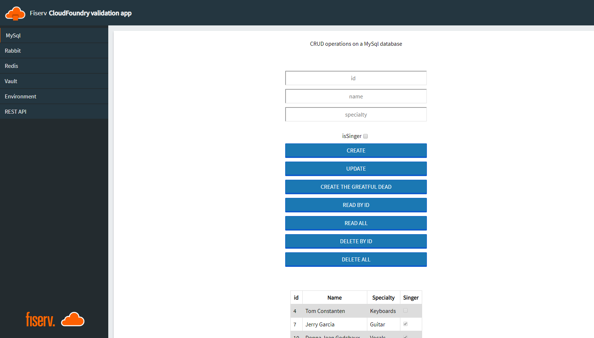

# PCF-ServiceTest-Java
Unified PCF service test app. Written in Spring / Java.
# Buidling
```bash
mvn package
cf push
```
## MySQL
- Lazy initialized the database schema
- Feature to create an row
- Feature to update a row
- Feature to create the Grateful Dead
- Feature to read row by ID
- Feature to read all rows
- Feature to delete by ID
- Feature to detete all
## Rabbit
- Feature to produce a message
- Feature to consume a message
- Feature to produce ten random messages
- Feature to consume all messages
- Feature to get queue length
## Redis
- Feature to get a pair
- Feature to set a pair
- Feature to delete a pair
- Feature to get all pairs
- Feature to set random pairs
- Feature to flush all 
## Vault
- Feature to create a treasure hunt
- Feature to get a treasure hunt
- Feature to list all treasure hunts
- Feature to delete a treasure hunt


